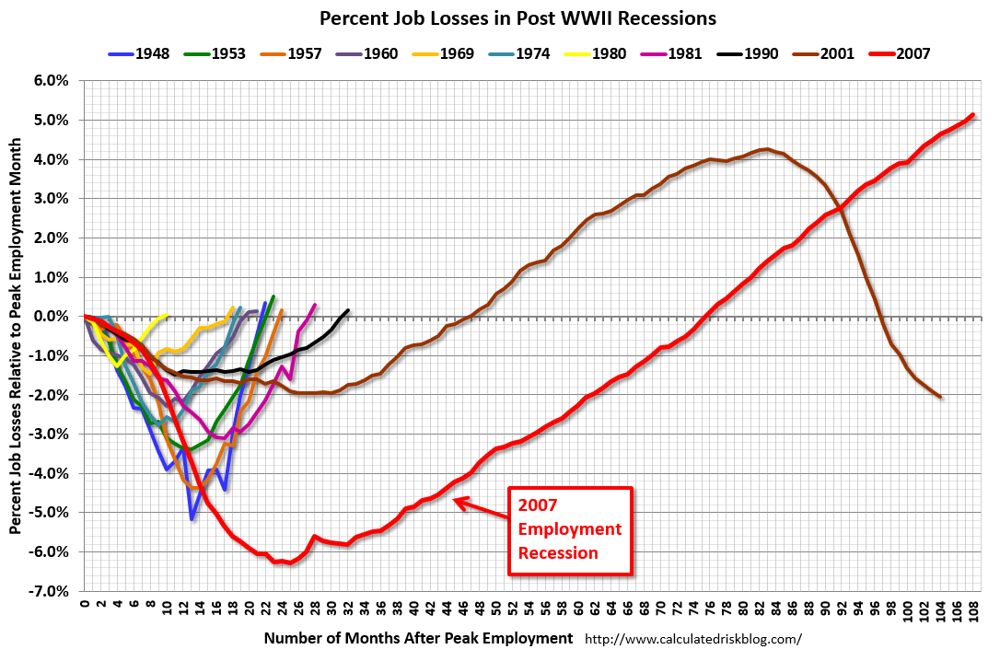
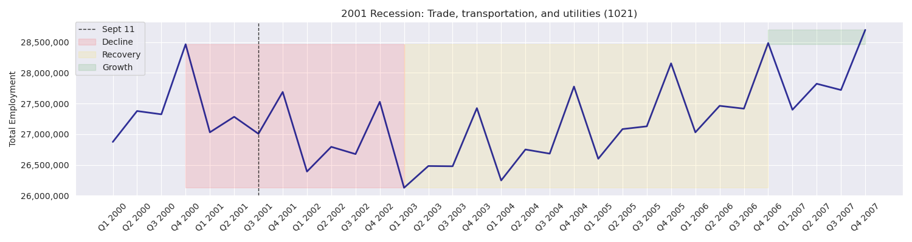
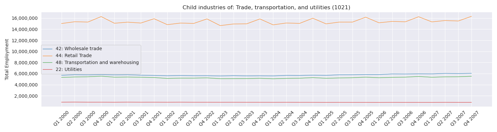
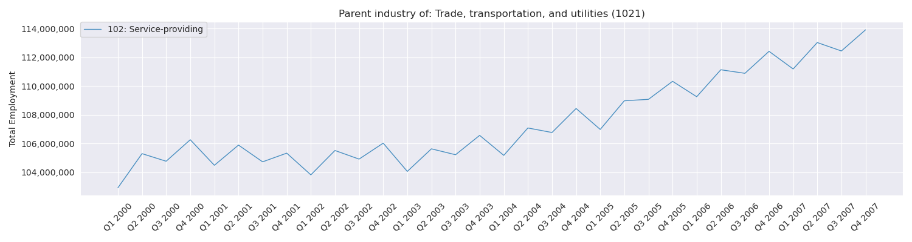
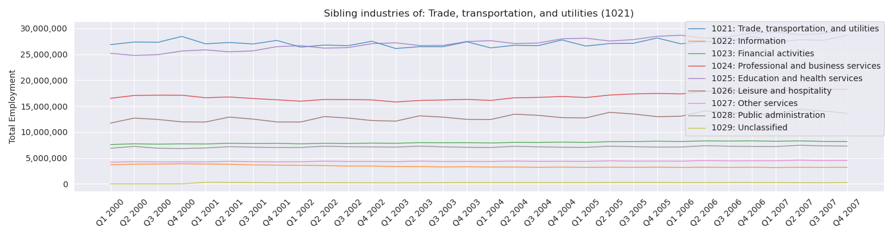
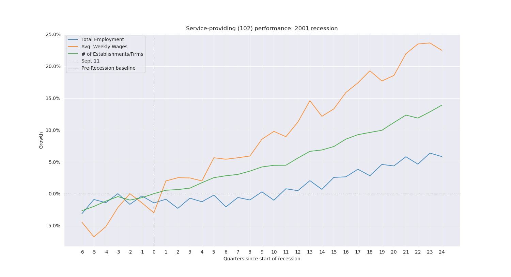

<h1>Project Overview</h1>
                
The U.S. in the 21st century is not particularly adept at recovering from recessions, and another one is upon us. This recession is likely to be deeper and longer than the last. Traditional measures of economic health (unemployment, GDP, stock market) are all too aggregated to be of much use for most Americans. Overall rise and/or fall does nothing for the outlook of a particular town or city, nor does it speak to the resiliency of particular economic sectors in the face of a recession. 

                
This project is a continuation of my capstone work for the Galvanize Data Science Immersive. While the previous iteration was a success given its time constraints, I want to expand the project to provide a scalable framework for working with QCEW data, and use it to analyze the trends in recessions in the US.

                
While modeling the recovery from the 2020 COVID-19 recession was the initial goal, I have expanded the scope to include making a scalable, reusable library for working with QCEW data.

    <h2>Project Goals</h2>
                    <ol type = "1">
                        <li>Develop an object-oriented module to define parameters of recessions, industries, and areas. (COMPLETE)</li>
                        <li>Expand parameters of the dataframe construction module to allow for automated construction of a timeline on any recession across any dimension(industry, area) or target variable (employment, wages, or firms). (COMPLETE)</li>
                        <li>Develop a module to automate charting of timelines. (COMPLETE)</li>
                        <li>Automate adjustment of NAICS industry classification changes into the timeline data and ensure consistency across recession timelines. (DEFERRED)</li>
                            <ul style="list-style-type:none;">
                                <li>- As the neural network models will not be affected by these changes, the amount of effort vs. the benefit to a user pulling up a report on one of the few industries affected. Will be revisited later.</li>
                            </ul>
                        <li>Develop a version of the "scariest chart", automated to include any dimension, variable, or recession. (COMPLETE)</li>
                        <li>Update the Flask interface to include new charts and features.</li>
                        <li>Create an AWS instance to allow others to run report cards on areas or industries.</li>
                        <li>Expand data collection to include political, fiscal, and population data for areas.</li>
                        <li>Experiment with neural networks to model economic recovery with the new dimensions</li>
                        <li>Add previous recessions as possible parameters.</li>
                        <li>Update report card to include model projections</li>
                    </ol>
<h1>Data Source</h1>
                
The dataset is compiled from the  Bureau of Labor Statistics(BLS) Quarterly Census of Employment and Wages (QCEW). The BLS archives contain economic data stretching back decades, across geographic designations and NAICS industry classifications.

                
 Data can be downloaded <a href = "https://www.bls.gov/cew/downloadable-data-files.htm">here</a>.

                
While employment numbers are available on a monthly basis, wages and establishments only have quarterly data. Therefore, I will primarily be working with quarterly timelines.
    <h2>Downloading Data</h2>
                download_files.py contains the functions that download, unpack, and rename the BLS files. Archives are deleted after unpacking, however this still requires many gigs of free disk space. This can take a good deal of time depending on internet connection speeds.
<h1>Definitions</h1>
                
The below chart is the inspiration for this project, and may help contextualize some of the definitions below.

                    </img>
    <h2>Recession</h2>
                
Recession parameters are stored in recessions.py 
                
Recessions are defined by economists, and while there is some debate on the qualifications of a recession, for simplicity's sake I will use the defined recessions included in the graph.

                
In order to capture the information required, the timelines in question include the <i> full calendar year before the recession event </i>, extending to the <i>full calendar year prior to the <b>next</b> recession event</i>. While the recession officially ends long before that, not every area/industry recovers on that timeline, and we must capture that information.
        <h3>Recession Event</h3>
                
An event popularly considered to be a catalyst for the recession.   
        <h3>Included Recessions</h3>
                    <ul>
                        <li><b>2001</b>- Timeline: 2000-2007. Event: Sept 11, Q3 2001. </li>
                        <li><b>2008</b>- Timeline: 2007-2019. Event: Financial Crisis, Q3 2008. </li>
                        <li><b>Full</b>: Timeline: 2007-2019. This designation exists only to produce timelines across all recessions included.</li>
                    </ul>
    <h2>Dimension</h3>
        <h3>Area</h3>
                
Area parameters are stored in area.py
                
The BLS data includes four different types of area designations:
                    <ul>
                        <li>National: The full United States economic data. There are also designations for Metropolitan and Non-Metropolitan areas.
                        <li>State: One of fifty recognized states. This also includes Puerto Rico and the U.S. Virgin Islands
                        <li>County: County designations within states. This includes Puerto Rican Municipios and individual islands within the U.S. Virgin Islands
                        <li>Metropolitan Statistical Area: Cities within the US.
                        <li>Combined Statistical Area: Wider definitions to capture populous areas across cities and even state lines.
                    </ul>
                
<b>area_fips</b>(str) is the index for areas.
                
More information can be found <a href = "https://www.bls.gov/cew/classifications/areas/area-guide.htm">here.</a>
        <h3>Industry</h3>
                
Industry parameters are stored in industries.py
                
Industries are defined according to NAICS. The data is hierarchical and quite complex. Broad-encompassing industries are broken down into more granular ones lower in the hierarchy.
            <h4>Child Industry</h4>
                
When an industry is broken down into more smaller industries, I am defining each of those as a child industry
            <h4>Parent Industry</h4>
                
 The industry a child industry comes from.
            <h4>Sibling Industries</4>
                
The set of child industries from a single parent industry.
            <h4>Generation</h4>
                
Where in the industry hierarchy an industry falls.
                
<b>industry_code</b>(int) is the index for industries.
                
More information can be found <a href = "https://www.bls.gov/cew/classifications/industry/home.htm">here.</a>
        <h3>Potential future dimensions to add to the project:</h3>
                    <ul>
                        <li>Population(U.S. Census)
                        <li>State budgets
                        <li>Partisan control of government
                    </ul>
    <h2>Targets</h2>
                
One of the three targets (referred to as variables in the code) that is used to judge economic health.
        <h3>Employment</h3>
                
The number of jobs in each industry/area. In this project, I will only be using quarterly numbers.
                
<i>Column Name: month3_emplvl</i>
        <h3>Wages</h3>
                
The average weekly wage in each industry/area.
                
<i>Column Name: avg_wkly_wage</i>
        <h3>Establishments/Firms</h3>
                
The number of firms operating in each industry/area.
                
<i>Column Name: qtrly_estabs_count</i>
<h1>Goals Progress</h1>
    <h2>1. Object-Oriented Approach</h2>
                
area.py, recessions.py, and industries.py each contains variable constants referred to throughout the project, and a class to define and store important parameters for analysis. These will continue to be expanded as the project evolves.
    <h2>2. Dataframe Construction Refactor </h2>
                
produce_datasets has been streamlined, depreciated code moved to the depreciated code file. helper_functions.py has been depreciated, functions moved to produce_datasets.py.
                
The main function (create_timeline) has new parameters and options. It can now function on any target, dimension, or recession. It also contains options one whether or not to save the dataframe as a json file, as well as derive the variables listed below. (Derived variables greatly increase computing time).
        <h3>Derived Variables:</h3>
                
The below variables are computed based on the recession timelines

                    <ul>
                        <li>pre-peak: The high point of the timeline <i>before</i> the nadir.</li>
                        <li>pre_peak_time: The number of quarters (from the beginning of the timeline) until the pre-peak.</li> 
                        <li>pre_peak_qtr: The quarter at which the pre-peak occurs.</li> 
                        <li>decline_time: the number of quarters between the pre-peak and the nadir.</li>
                         
                        <li>nadir: The low point in the timeline. Excludes the first seven columns when computing.</li>
                        <li>nadir_time: The number of quarters (from the beginning of the timeline) until the nadir.</li>
                        <li>nadir_qtr: The quarter at which the nadir occurs.</li> 
                         
                        <li>recovery: Whether or not the timeline recovers from the recession before the end of the timeline (Is post-peak >= pre-peak). 
                        <li>recovery_time: the number of quarters between the nadir and when the timeline surpasses the pre-peak. Will be NaN if recovery == 0.
                        <li>recovery_qtr: The quarter at which the recovery occurs.</li> 
                         
                        <li>post-peak: The high point of the timeline <i>after</i> the nadir.</li>
                        <li>post_peak_qtr: The number of quarters (from the nadir) until the post-peak.</li>
                        <li>post_peak_qtr: The quarter at which the post-peak occurs.</li>
                        <li>growth_time: the number of quarters between the recovery and the post-peak.</li>
                         
                        <li>delta: the difference between pre-peak and post-peak.
                    </ul>
    <h2>3. Timeline Charting: The Vector Class</h2>
                
In order to support the Flask app, I need a good-looking chart to easily show the economic progress of a selected unit. I created charting.py to contain all the various charting functions needed.
                
I created a class Vector to gather all the necessary information and plot the various graphs. It is agnostic to recession, dimension, and target, to minimize technical debt.
                
The class vector  an produce the following charts:
                    <ol type ='1'>
                        <li>The vector itself. Shading is optional.
                            </img>
                            <i>Future Item:</i> work on shading between the line and peak, rather than a solid rectangle.
                        <li>Industry children.
                            </img>
                        <li>Industry parent.
                            </img>
                        <li>Industry siblings.
                            </img>
                    </ol>
                
charting.py also has functions to chart relative gains/losses, like the "scary chart" above.
                
There is function for comparison across recessions:
                    </img>
                
as well as across target/variables:
                    </img>
                
The charts surface some issues with the data (e.g. seasonality). These will be addressed in later branches.

            

 
    