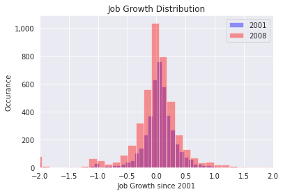
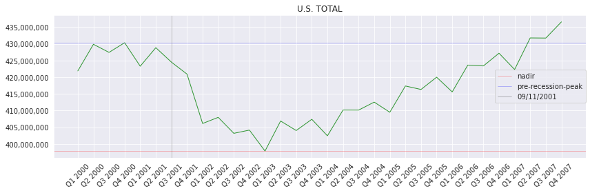
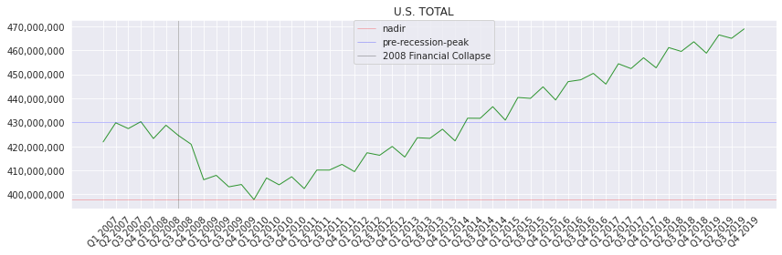
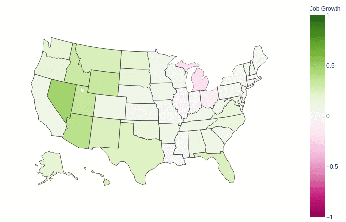
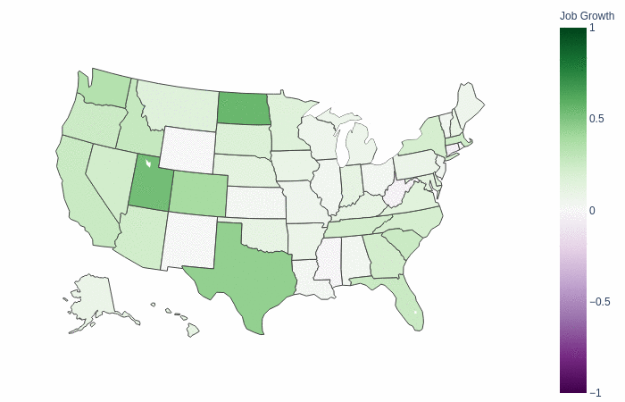
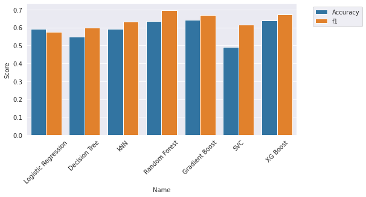
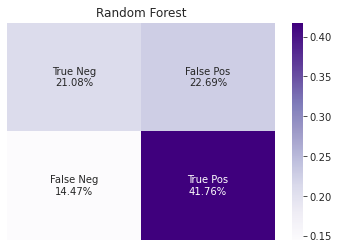
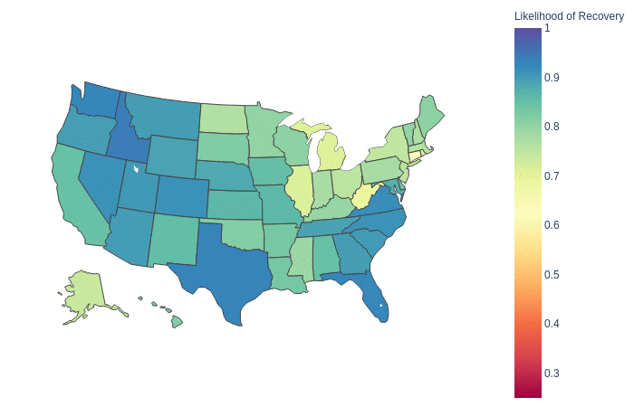

<h1>Video Presentation</h1>

<h1>Project Overview</h1>
    
The U.S. in the 21st century is not particularly adept at recovering from recessions, and another one is upon us. This recession is likely to be deeper and longer than the last. Traditional measures of economic health (unemployment, GDP, stock market) are all too aggregated to be of much use for most Americans. Overall rise and/or fall does nothing for the outlook of a particular town or city. With this project I intend to break down economic data from the Bureau of Labor Statistics, and use the data to model and predict economic recovery. Specifically, I intend to answer:

    <ol>
        1. Which areas (counties, states, cities) are likeliest to recover from this recession, before the *next* recession.
        2. How long will each area be in decline, before it begins to recover?
    </ol>
    
    <h2>Previous Research</h2>
    
Most data science being applied to this type of problem are attempting to predict *when* a recession might occur (https://towardsdatascience.com/recession-prediction-using-machine-learning-de6eee16ca94,https://economics.rabobank.com/publications/2019/january/united-states-the-recession-of-2020/), but they often rely on indices of long-term economic performance. They also do not differentiate performance in different *sectors* of the economy, so the definition of a recovery can mean little to workers employed in sectors that falter. Some attempts to use sampled data have been successful (http://www.sundsoy.com/publications/tow.pdf), but would not provide the granularity I am looking for to narrow down recovery in specific areas. 

    <h2>New Additions</h2>
    
This is not the first time I have worked with this data, attempting to solve this problem. However, the previous attempt hit several snags along the way. I attempted to augment the dataset with political and fiscal features, but that required me to cull nearly half the data as it wasn't available for most cities. The model did not show much feature importance for any of the political variables. The cities have been added back in, as have Puerto Rico and the U.S. Virgin Islands.

    <h3>Goals</h3>
    
As before, I intend to model the economic performance of each area within the United States, using data from the 2001 and 2008 recessions. I have some additional goals to bring the project further.

    <ul>
        <li>Deploy a Flask app which will allow the user to view a "report card" on any particular area included in the dataset</li>
        <li> Add additional model types to the pipeline</li>
        <li> Get f1 score of final model above 0.85</li>
        <li> Explore using a Neural Network to predict the data.</li>
    </ul>
 
<h1>Data</h1>

The dataset is compiled from the  Bureau of Labor Statistics(BLS) Quarterly Census of Employment and Wages (QCEW). Two recessions worth of data are included. From 2000 - 2007 and 2007 - 2019. Both include a full year before the recession event (see below).

<h2>Definitions and Assumptions</h2>

<h3>Recession Events</h3>

Each recession in my training data set (2001, 2008) have a particular *event* which corresponds with a sudden drop in economic forecasts (9/11 and the stock market crash of 2008). While these events are not necessarily the beginnings of their corresponding recessions,they do represent the largest, steepest drops in employment. For the purposes of this project, the recession will be defined as beginning at these events.

<h3>Nadir</h3>

This is defined as the point at which an areas job numbers reach their lowest point during the time period in question.

<h3>Pre-Recession Peak</h3>

This is defined as the 'high point' of employment numbers *before* the nadir.

<!---
<h3>Recovery Point</h3>

When an area achieves its job numbers equal or greater than its Pre-Recession Peak before the next recession.

--->

<h3>Post-Recession Peak</h3>

The 'high point' of jobs numbers *after* the nadir, but before the next recession event.

<h2>Features</h2>

There are two types of features in the dataset. Dummy variables for the type of area in each row, and jobs in each industry

<h3>Dummy Variables</h3>
<ul>
    <li>State (includes Puerto Rico and U.S. Virgin Islands</li>
    <li>City</li>
    <li>Aggregated (Entire U.S., U.S. Cities, or U.S. Nonmetropolitcan Areas</li>
</ul>

Area with non of the above designations are counties, but do not have a corresponding dummy variable.

<h3>Industry Features</h3>

Approximately 2400 industries are included. Column '10' indicates the total number of jobs in each area. All other features are proportional to the total number of jobs.

<h2>Targets</h2>

<h3>Primary Target:Recovery (boolean)</h3>

Whether or not an area achieves a recovery point before the next recession.

<h3>Secondary Target:Job Growth</h3>

 The difference between the pre-recession peak and the post recession peak

<h3>Tertiary Target: Decline Time</h3>

The number of quarters between the Pre-Recession Peak and the Nadir.

The distribution of job growth in both years is roughly Gaussian, with a mean hovering around 0. 

For both recessions, the entire US took about 18 months (6 quarters) to start adding net jobs. Which gives us an overall decline time of 6.

Statewide performance in the 2001 recession is clustered around zero. As shown in the gif below, none of the states seem to have dramatic changes in job growth over the period of the recession. It *is* worrying that despite population increase, job growth is centered at 0, which shows an overall drop in job numbers, but that concern is beyond the scope of this project.

County-level results show much more variance in economic performance, however. This reinforces my earlier point that aggregating economic data hides crucial context.

2008 reiterates my point, though it does show the difference in scale between 2001 and 2008.

<h1>Models Progress</h1>

Last time I only tested four different types of models, (Logistic Regression, Decision Tree, Random Forest, and Gradient Boost). I had a goal to get my f1 score as high as possible. So I added XGBoost, SVG, and KNN to the mix.

Just like last time, the Random Forest model performed the best, returning the best f1 score. I took several days of tuning to attempt to get it as high as possible, but I was only able to get it up to 0.709 to 0.719. There is likely little improvement to be found with this feature set.

<h1>2020 Forecast</h1>

